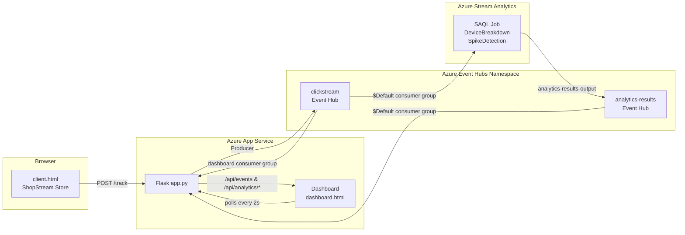

# Assignment 2
**CST8916 – Remote Data and Real-time Applications**

[Demo Video](https://youtu.be/48jAKKMPDFg)

---
## Documentation
AI was use to auto fill parts in functions, scripts and html to my desire. It was also to used to question about the design/architect and helps choose an direction. 
### Architecture



**Data Flow:**
1. The browser (client.html) sends click events via `POST /track` to the Flask backend.
2. Flask publishes each event to the **clickstream** Event Hub.
3. Two consumers read from the clickstream Event Hub using separate consumer groups:
   - **`$Default`** — Azure Stream Analytics ingests events and runs two windowed queries (DeviceBreakdown, SpikeDetection), outputting results to the **analytics-results** Event Hub.
   - **`dashboard`** — Flask's background consumer thread buffers raw events for the live feed and KPI cards.
4. A second Flask consumer thread reads from the **analytics-results** Event Hub to get device breakdown and spike detection data.
5. The dashboard polls `/api/events`, `/api/analytics/devices`, and `/api/analytics/spikes` every 2 seconds to render live analytics.

### Design Decisions

- **Dual consumer groups** on a single Event Hub instead of duplicating data — both Stream Analytics and the Flask consumer see 100% of events independently without a second hub for raw events.
- **Two Event Hubs** (`clickstream` for raw events, `analytics-results` for Stream Analytics output) — keeps the raw stream separate from processed analytics.
- **HoppingWindow(second, 60, 10)** for spike detection — evaluates every 10 seconds over a 60-second window for near-real-time spike detection without excessive compute.
- **TumblingWindow(minute, 1)** for device breakdown — provides stable per-device counts refreshed every minute.
- **Local fallback** in API endpoints — if Stream Analytics results haven't arrived yet, the dashboard computes device/spike data from the raw event buffer so the UI is never empty.
- **Separate consumer threads** — each `consumer.receive()` blocks forever, so the clickstream consumer and analytics consumer each run on their own daemon thread.

### Stream Analytics Queries (SAQL)

| Query | Purpose | Window | Output |
|-------|---------|--------|--------|
| **DeviceBreakdown** | Counts events, unique users, and event types per device | `TumblingWindow(minute, 1)` | `query_type = 'device_breakdown'` |
| **SpikeDetection** | Detects traffic spikes based on event volume thresholds (normal / spike / critical) | `HoppingWindow(second, 60, 10)` | `query_type = 'spike_detection'` |

### Set Up

**Prerequisites:**
- Python 3.11+
- Azure subscription with Event Hubs namespace

**Local Development:**
```bash
pip install -r requirements.txt
```

Create a `.env` file:
```
EVENT_HUB_CONNECTION_STR=Endpoint=sb://<namespace>.servicebus.windows.net/;SharedAccessKeyName=...;SharedAccessKey=...
EVENT_HUB_NAME=clickstream
EVENT_HUB_ANALYTICS_NAME=analytics-results
```

Create the `dashboard` consumer group on the clickstream Event Hub:
```bash
az eventhubs eventhub consumer-group create \
  --resource-group <rg> \
  --namespace-name <namespace> \
  --eventhub-name clickstream \
  --name dashboard
```

Run the app:
```bash
python app.py
```

Open `http://localhost:8000` for the store and `http://localhost:8000/dashboard` for live analytics.

**Cloud Development:**

1. **Create a Resource Group** (if not already created):
   ```bash
   az group create --name <rg> --location canadacentral
   ```

2. **Create an Event Hubs Namespace and Hubs:**
   ```bash
   az eventhubs namespace create --name <namespace> --resource-group <rg> --sku Basic
   az eventhubs eventhub create --name clickstream --namespace-name <namespace> --resource-group <rg>
   az eventhubs eventhub create --name analytics-results --namespace-name <namespace> --resource-group <rg>
   az eventhubs eventhub consumer-group create --resource-group <rg> --namespace-name <namespace> --eventhub-name clickstream --name dashboard
   ```

3. **Get the Event Hub Connection String:**
   ```bash
   az eventhubs namespace authorization-rule keys list \
     --resource-group <rg> --namespace-name <namespace> \
     --name RootManageSharedAccessKey --query primaryConnectionString -o tsv
   ```

4. **Create a Stream Analytics Job:**
   ```bash
   az stream-analytics job create --name <job-name> --resource-group <rg> --location canadacentral
   ```
   - Add **Input**: Event Hub `clickstream` (alias: `clickstream-input`, consumer group: `$Default`)
   - Add **Output**: Event Hub `analytics-results` (alias: `analytics-results-output`)
   - Paste the query from `stream_analytics_queries.sql`
   - Start the job

5. **Create an App Service and Deploy:**
   ```bash
   az appservice plan create --name <plan-name> --resource-group <rg> --sku B1 --is-linux
   az webapp create --name <app-name> --resource-group <rg> --plan <plan-name> --runtime "PYTHON:3.11"
   ```

6. **Configure App Settings:**
   ```bash
   az webapp config appsettings set --name <app-name> --resource-group <rg> --settings \
     EVENT_HUB_CONNECTION_STR="Endpoint=sb://<namespace>.servicebus.windows.net/;SharedAccessKeyName=...;SharedAccessKey=..." \
     EVENT_HUB_NAME="clickstream" \
     EVENT_HUB_ANALYTICS_NAME="analytics-results" \
     SCM_DO_BUILD_DURING_DEPLOYMENT="true"
   ```

7. **Deploy the Code:**
   ```bash
   az webapp up --name <app-name> --resource-group <rg> --runtime "PYTHON:3.11"
   ```

8. **Add a Startup Command** (so App Service uses gunicorn):
   ```bash
   az webapp config set --name <app-name> --resource-group <rg> \
     --startup-file "gunicorn --bind=0.0.0.0:8000 app:app"
   ```

9. **Verify:** Open `https://<app-name>.azurewebsites.net` for the store and `/dashboard` for live analytics. 
